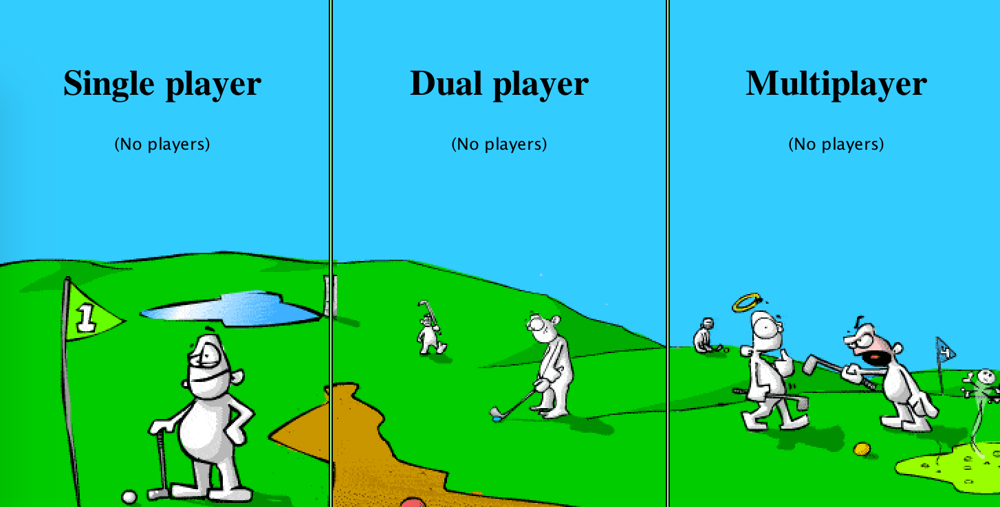

# Minigolf Server/Client/Editor (Plaforia)

## Screenshot



## Context

Playforia.net was an online game community created by Finnish game studio Playforia Inc. in 2002. As of the end of 2018, Playforia announced to close its web presence on January 7th, 2019. (Wikipedia: https://en.wikipedia.org/wiki/Playforia)
The gaming platform was also formerly known as Aapeli or Playray.

The Java Applet-based Minigolf Client was one of the most popular multiplayer games on the platform. When I found a partially working codebase for parts of the Playforia related Java-Projects on GitHub (https://github.com/WorldStarHipHopX/playforia) I got it running on my computer by implementing a few small changes, which are explained below.

## Features

### Original game
- 3718 Maps in 8 Categories
- Up to 4 players or Single Player mode
- Graphics quality options
- ...

### Reimplementation
- Commented out any communication with original Playforia.net servers
- Use local Map store instead of database
- Added ability to pass IP of server to client
- Ability to play on on a single computer and hosting a game for up to 4 players in your home network

## Usage

### Prerequisites
- Clone this repo: `git clone git@github.com:PhilippvK/playforia-minigolf.git`
- Install Java Development Kit 8 (https://www.oracle.com/technetwork/java/javase/downloads/jdk8-downloads-2133151.html)
- Install Apache `ant` for building: https://ant.apache.org/manual/install.html
- *Optional:* Install IntelliJ IDEA Java IDE (https://www.jetbrains.com/idea/download/) and import this reposiory as project 

### Building

There are 3 directories of interest: `client`, `server` and `editor`, which should compile quite easily.
Choose your prefered toolchain:
1. **IntelliJ IDEA**:Import Project from git and compile
2. **Ant Build**: Run `ant compile` in the repective directory

### Running

First, the server application has to be started as it provides ressources like sounds, maps and textures which are required for "offline" modes, too.
Assuming that all 3 tools have compiled sucessfully, you have 3 possible ways for running the server binary:
1. Using the IntelliJ IDE: Use the provides build artifacts or run the server by pressing the play button after compiling
2. Using the Ant tool: Run `ant run` in the `./server` directory
3. Use the exported JAR file: `java -jar server.jar`

The client can be started the same way (AFTER THE SERVER WAS STARTED) but in the case the server is not hosted on the same computer, you can pass the server IP like this while launching the client application:

```bash
java -jar client.jar 192.168.1.7 # Replace IP with the one of your server (which you can find out by f,e. `ifconfig`/`ipconfig`)
```

After the Login screen, which can be skipped with an empty form, you should see your familiar Playforia Minigolf Menu!


Running the Editor is quite straightforward as it can be started like 

## Compability

Tested:
- MacOS 10.14.5 Mojave with Java Version `1.8.0_152-ea` with JDK
- Raspbian Strech (9) with Java version 1.8.0\_65

Untested: (Will likely be compatible, too!)
- Windows
- Ubuntu
- ...

## Problems
- BadWordFilter is disabled because of character encoding issue
- You can not choose a custom username
- Passwords and logins are ignored
- Ratings are not synced

## Notices

1. The code is neither written by me nor my property (Original Source: )
2. I am not responsible for any bug, problems, security flaws,...
3. Also, I do not intent to extend the current codebase very much
4. The Java code you will find in the repository is pretty bad. Some parts even look like they where generated, for example by an converter tool
5. There is actually an aimbot implemented in the client code. Look for `allowCheating` in `GameCanvas.java` for trying it out. Use it wisely.

## Final Words

Have fun.

If you miss the good old times before Playforia.net went down, Minigolf probably was one of your favourite games. I hope you will have some fun in the single player or with friends with this  little crappy piece of oldschool software!
